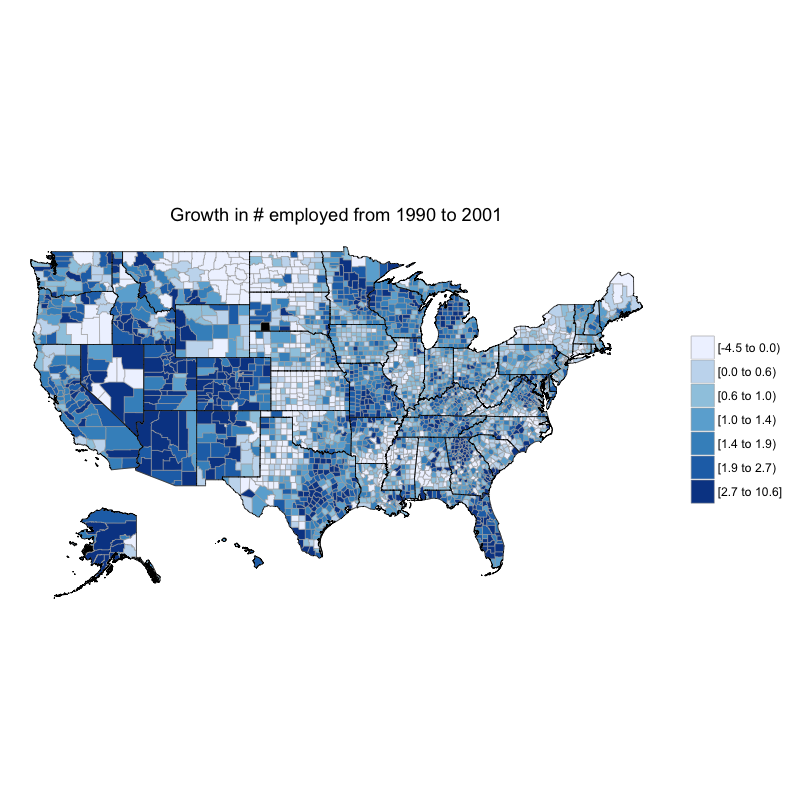
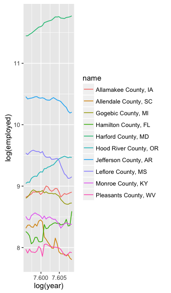
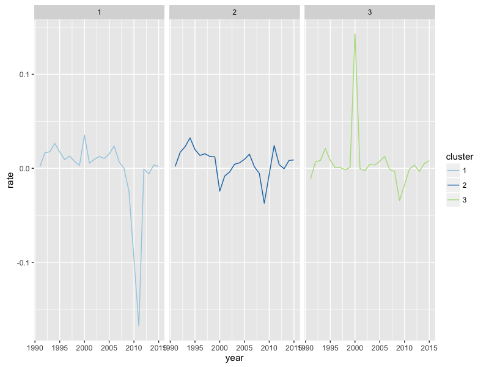
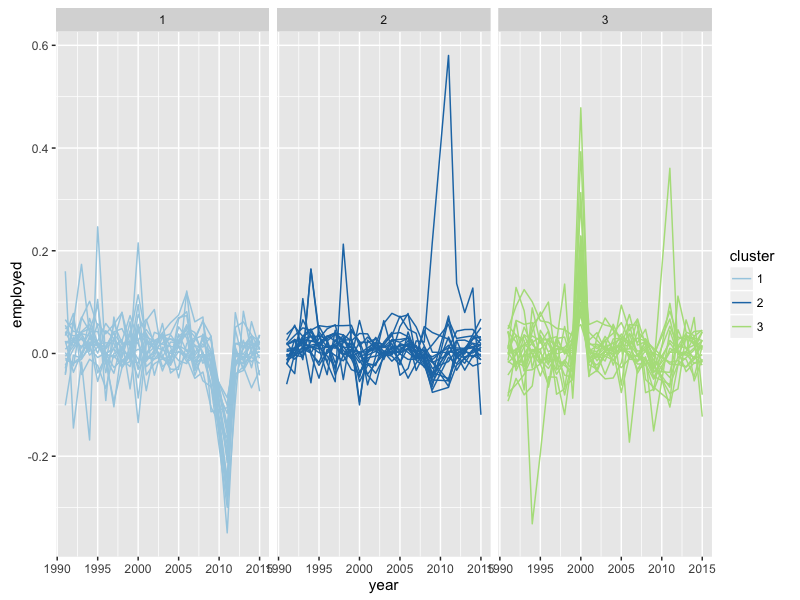
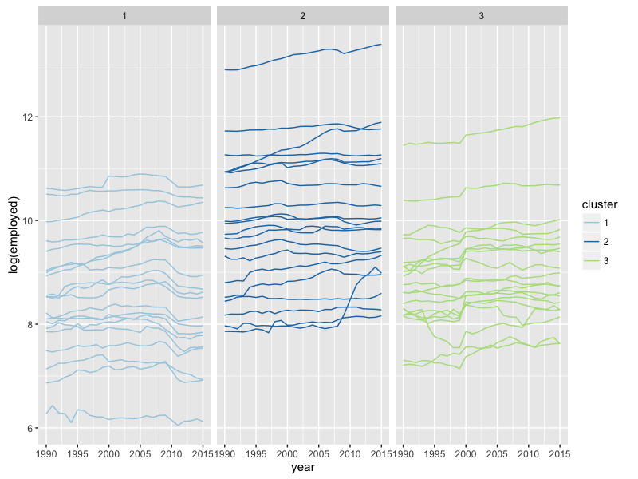
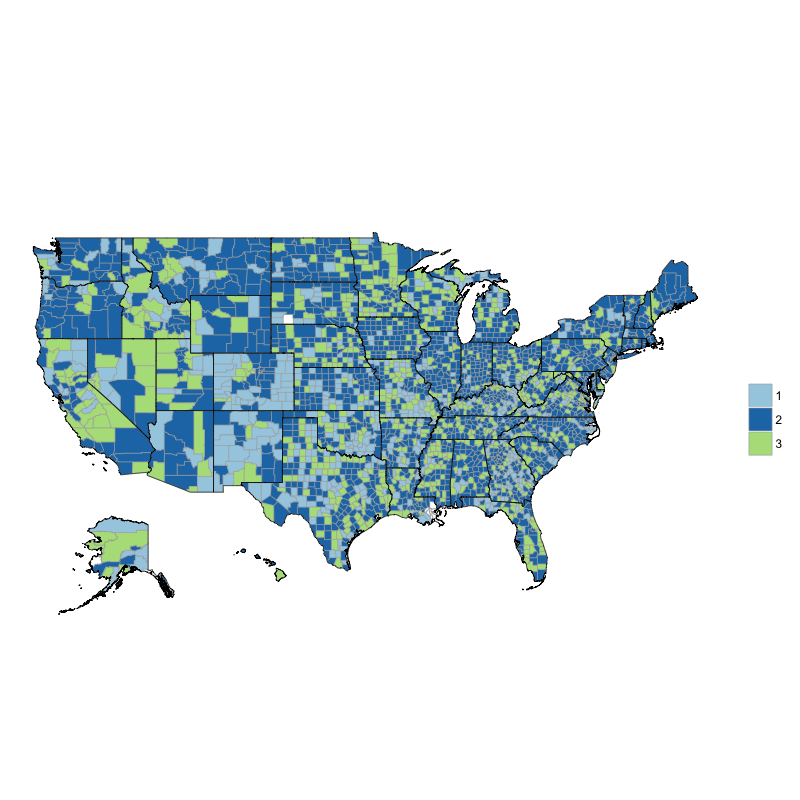

## Unemployment

There are four files, tidyHistoricalBLS.R, MapGrowth.R, plotTimeSeries.R, plotClusters.R.  They should be read in that order. 

In these files, I study the number of people employed in each county, between 1990 and 2015. 

---

First, we make a map of the growth rate over the 1990's:

---

Then, we want to understand more about the shapes of the employment curves. Here are 20 counties sampled randomly:

---

To summarize the 3000+ curves, find 3 clusters with k-means.  We represented each county as a 24-vector of growth rates over the 25 years.  Here are the centers (as time series of growth rates) of each of the three clusters.

---

Be careful!  There is variation around the center.  Here are a handful of random counties from each cluster:

---

The transformation into growth rate can make interpretation difficult.  Good to go back to the "original domain" of raw employment numbers. Here are the same handful of random counties from each cluster:

---

The clustering provides a partition of counties.  Here is what it looks like on a map.

